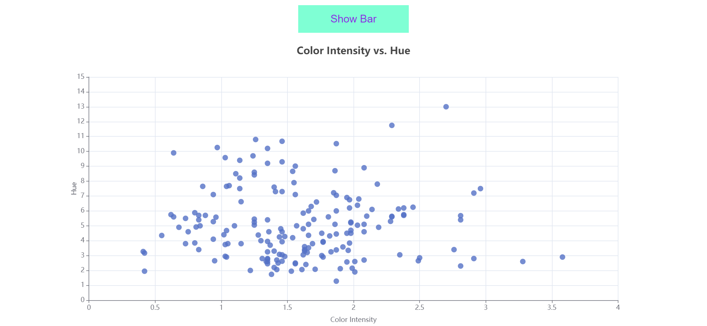
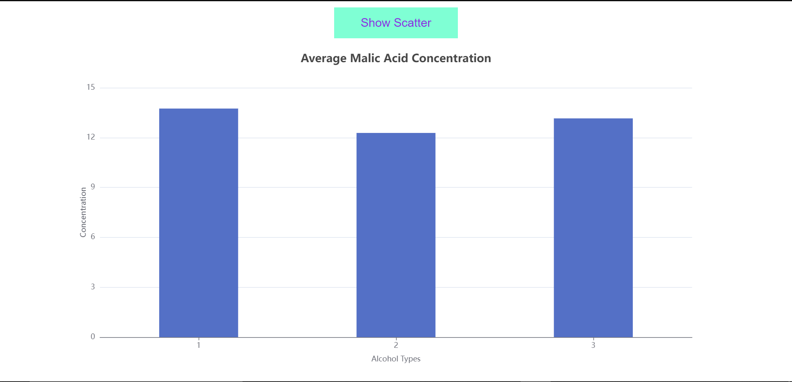

# Manufac Analytics Assignment

A guide to start the project.

## Steps to start the project

### step1:

Download the project.

### step 2

After opening the project type yarn install in the terminal.

### step3:

Then type yarn start in the terminal.

### step 4:

Check the UI in browser by typing localhost:3000 in the search bar.

